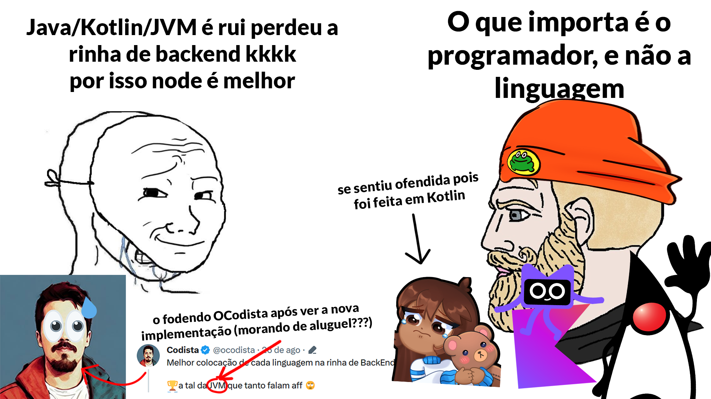

 

<h1 align="center">🐔 RINHA DE BACKEND 2023 Q3™ em Kotlin [Unleashed] 🐔</h1>

Uma implementação feita em [Kotlin](https://kotlinlang.org), pois Kotlin is my beloved , provando que o que importa é o programador, e não a linguagem usada.

A implementação foi baseada na implementação do [@distanteagle16](https://github.com/viniciusfonseca/rinha-backend-rust/) e do [@luucaspole](https://github.com/lukas8219/rinha-be-2023-q3)

Mais informações, como comparações com as outras implementações, na [thread no Twitter](https://twitter.com/MrPowerGamerBR/status/1696170967230239071)!

## 🔗 Redes Sociais
* **GitHub:** [`@MrPowerGamerBR`](https://github.com/MrPowerGamerBR)
* **Twitter/X:** [`@MrPowerGamerBR`](https://twitter.com/MrPowerGamerBR)
* **Website:** [`mrpowergamerbr.com`](https://mrpowergamerbr.com/)
